<H1> Realization of an application for the management of an automobile spare parts store </h1>

  <H6> University of Science and Technology USTHB </H6>
  <H6> IT department </H6>
  <H6> Software engineering project year (2017/2018) </H6>

<H3> Subject : </H3>
VENPIECE, company responsible for the manufacture and
commercialization of auto parts is interested in having its own
management software. The latter allows the management of different customers as well as their
orders, do accounts and invoice statements as well as monitor the status of
delivery and quantities in stock.
The software in question will be used by 3 workstations of the company:
- Commercial service
- Accounting Service
- The storekeeper

<H3> Software used : </H3>
<ul>
 <li> <H4> Java </H4> </li> 
 <li> <H4> JavaFX with sceneBuilder </H4> </li> 
 <li> <H4> XML </H4> </li>  
 <li> <H4> MySQl </H4> </li>  
 <li> <H4> iText7 </H4> </li>  
</ul>

<H3> Software screens : </H3>
<ol>
 <li> <H4> Commercial service </H4> </li> 
      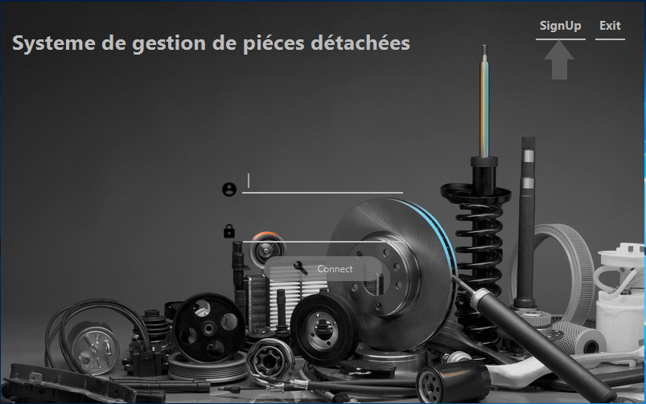
      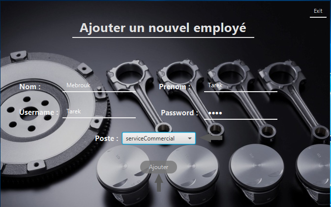
      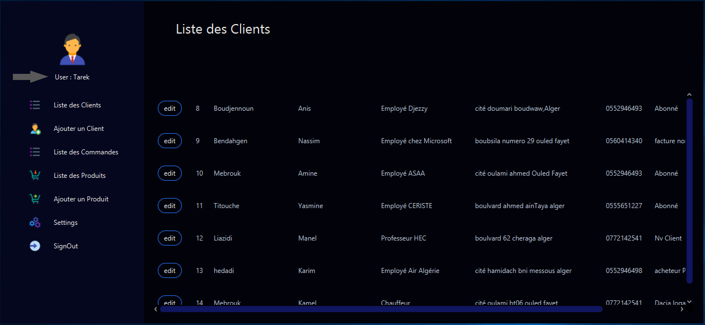
      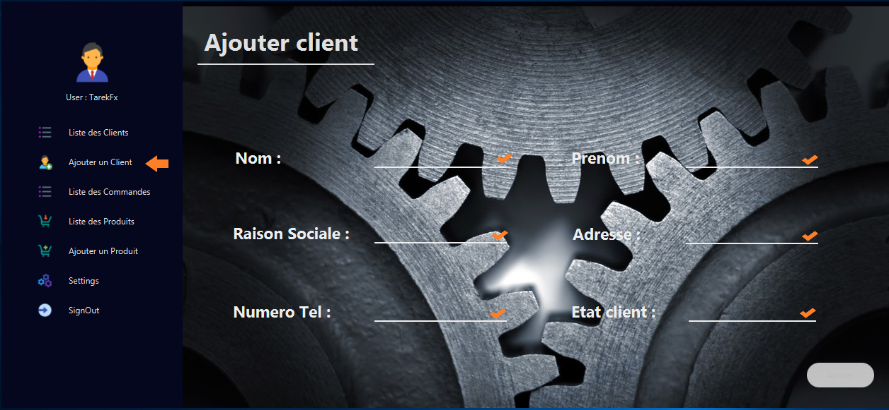
      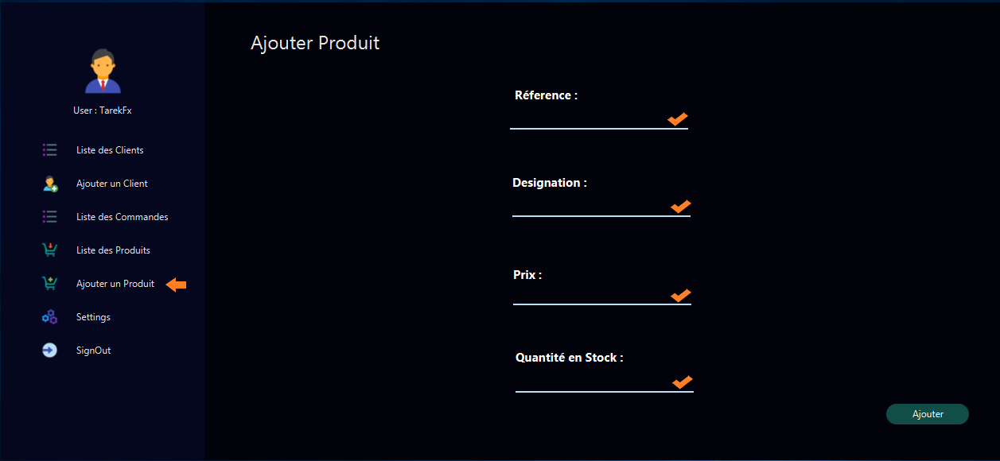
      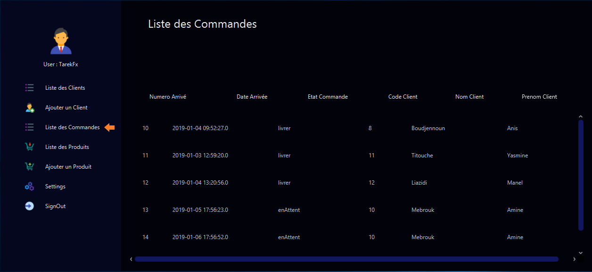
      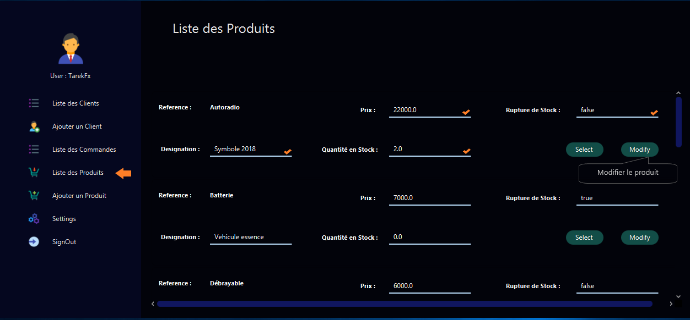
      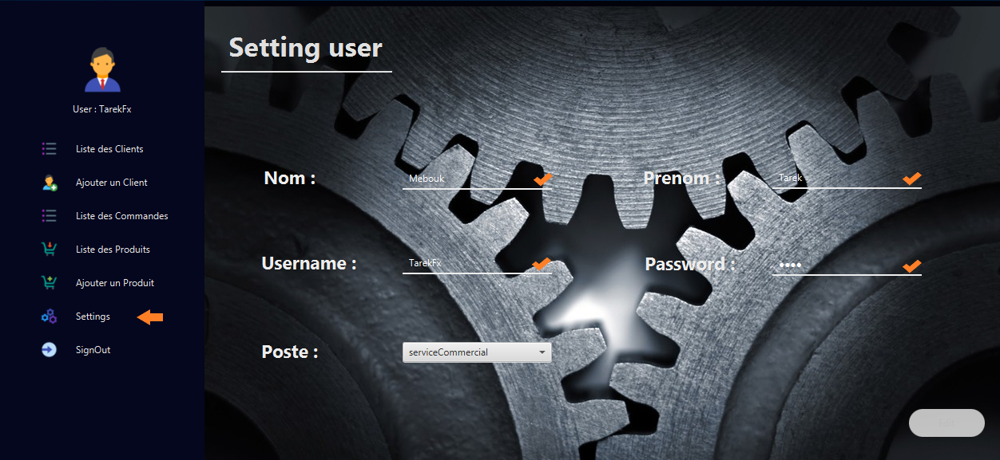
      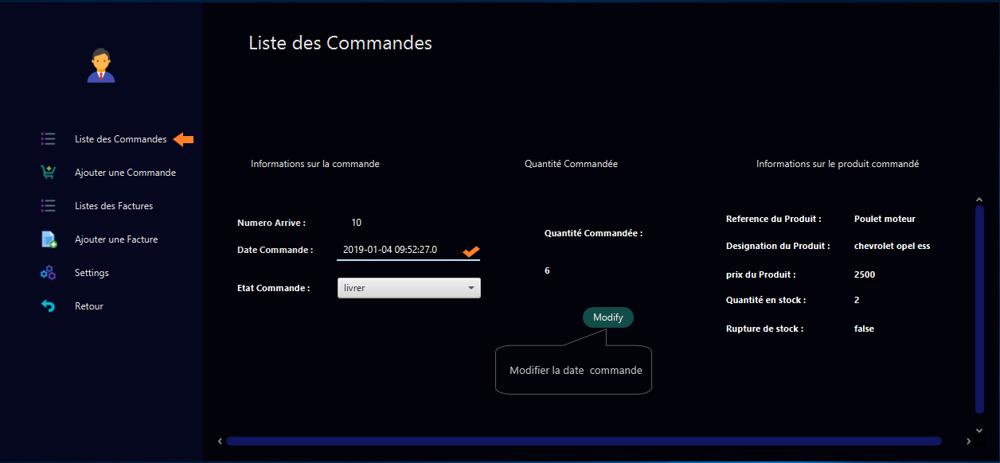
      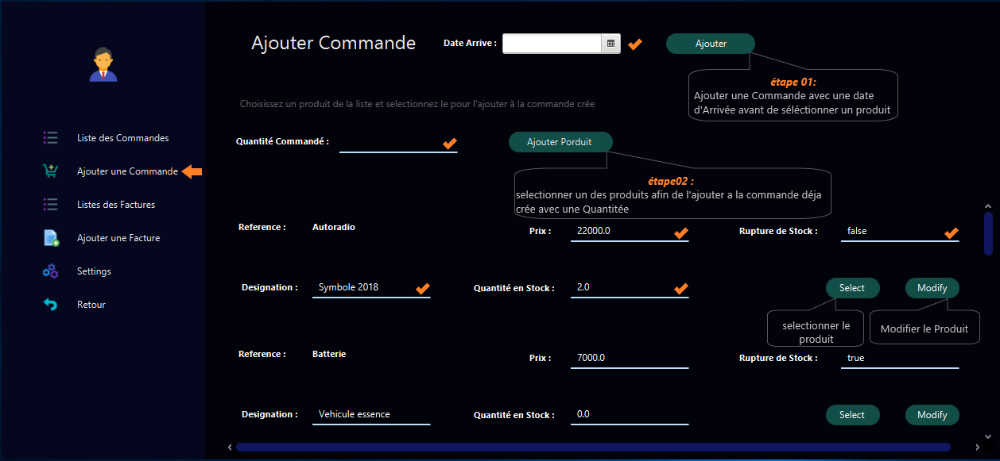
      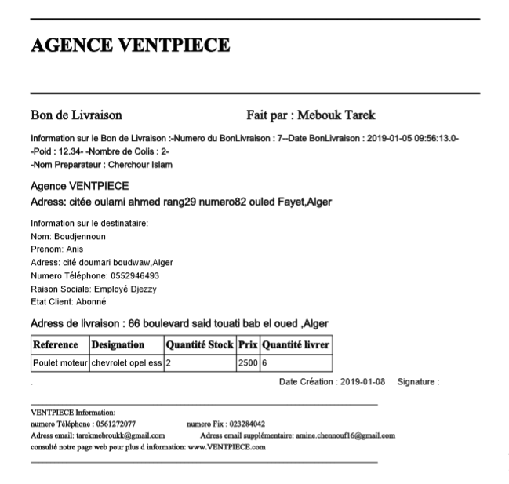
 <li> <H4> Accounting Service </H4> </li> 
      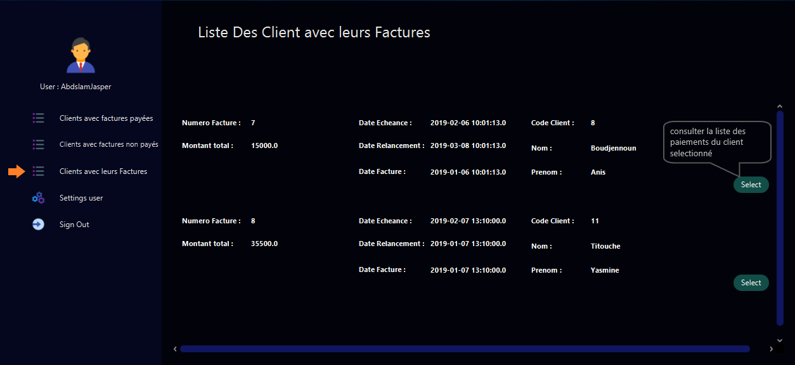
      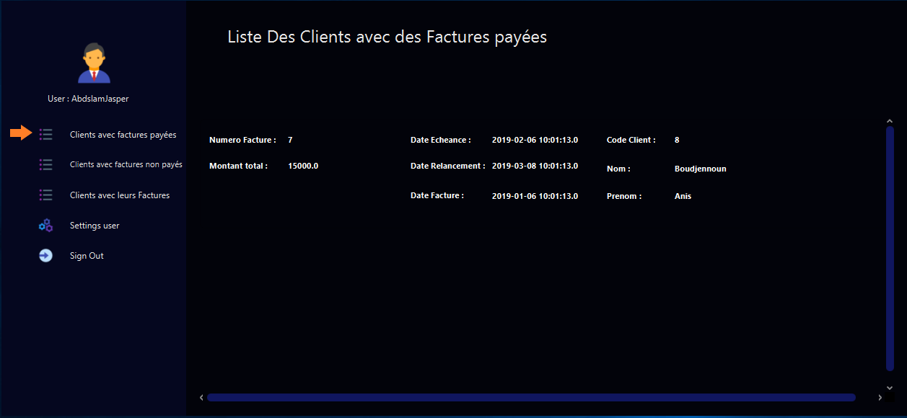
      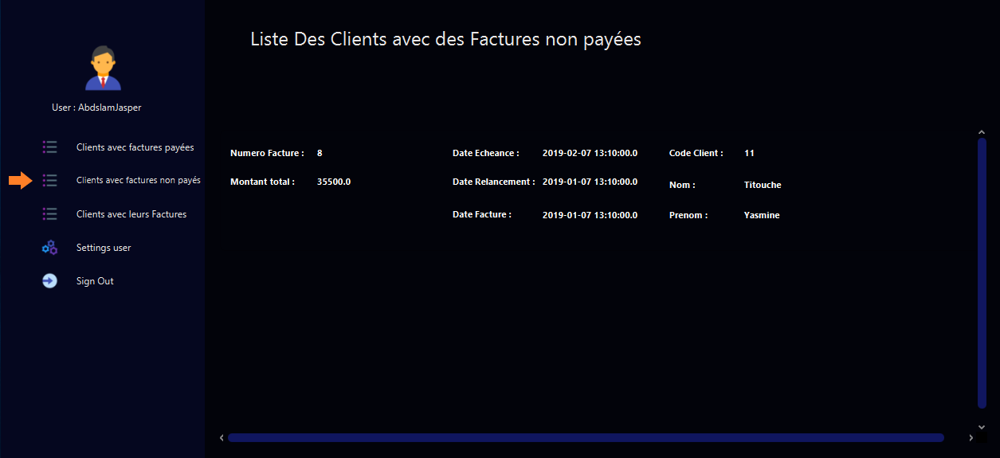
 <li> <H4> The storekeeper </H4> </li> 
      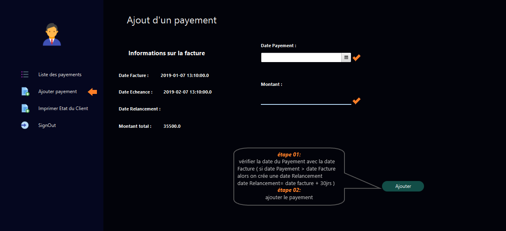
      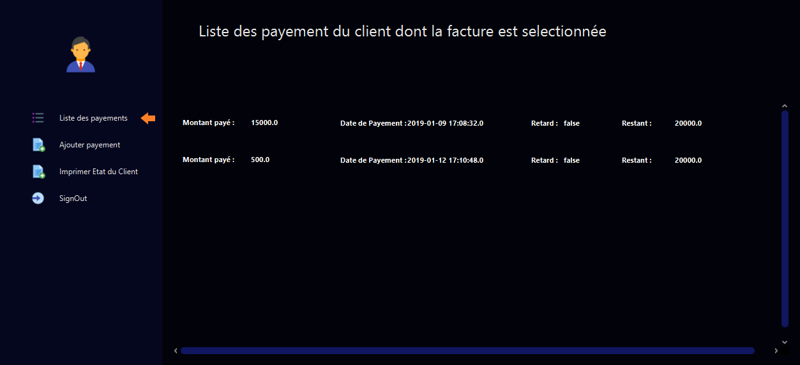
</ol>
